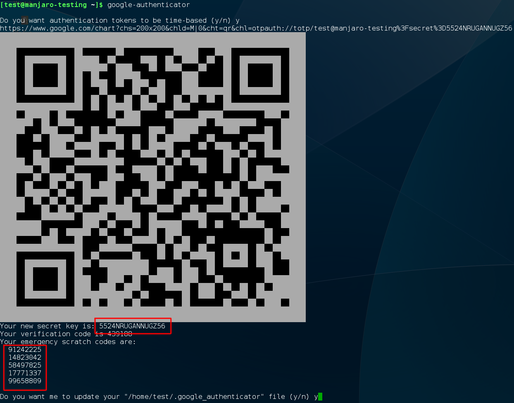
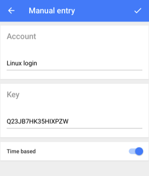
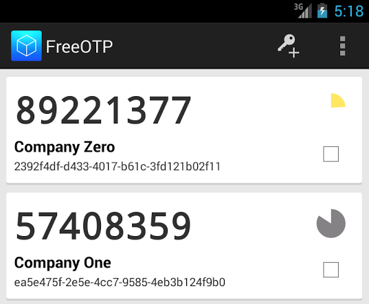
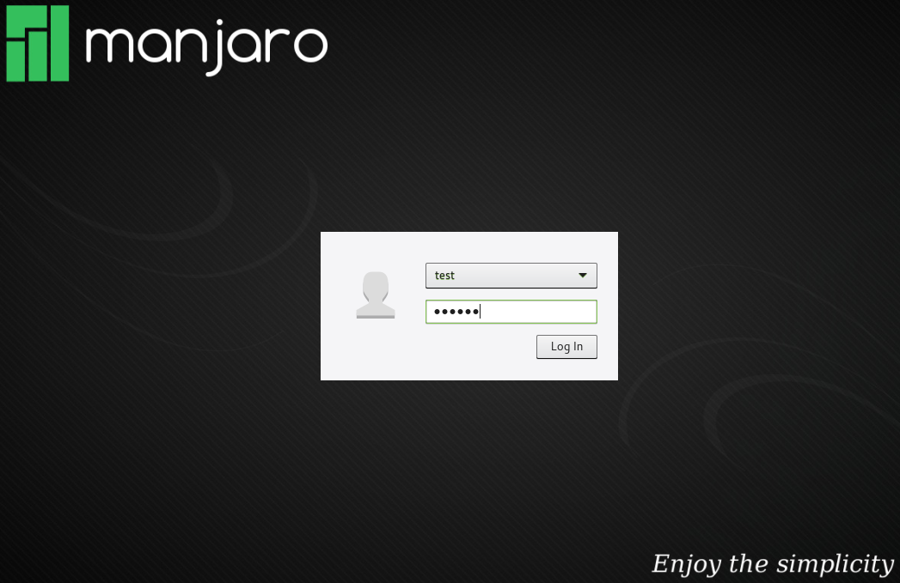
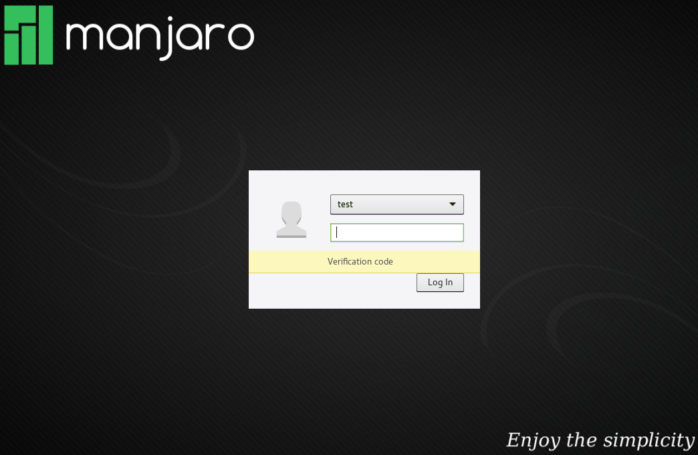
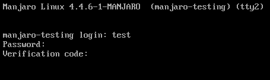

# Two Factor Authentication on Manjaro (with Google-Authenticator)
Setup Google-Authenticator Two-Factor-Authentification on Manjaro Linux. Event tough the Application was initially developed by Google it does no phone home for providing the two-factor auth service. The application supports the HMAC-Based One-time Password (HOTP) algorithm specified in [RFC 4226](https://tools.ietf.org/html/rfc4226)  and the Time-based One-time Password (TOTP) algorithm specified in [RFC 6238](https://tools.ietf.org/html/rfc6238). The Source-Code for the Linux Project can be found at [github/google-authenticator](https://github.com/google/google-authenticator).

Further reading
* [wikipedia](https://en.wikipedia.org/wiki/Google_Authenticator)
* [archwiki](https://wiki.archlinux.org/index.php/Google_Authenticator)

## Requirements
1. Manjaro Linux
2. Smartphone (Android / iPhone )

## Important Notes
This tutorial does not cover using Two-Factor-Authentification on systems with “home folder encryption” that encrypted your entire home directory until you enter your password. Specifically, this uses ecryptfs. However, because the PAM software depends on a Google Authenticator file stored in your home directory by default, the encryption interferes with the PAM reading the file unless you ensure it’s available in unencrypted form to the system before you log in. Consult the [README](https://github.com/google/google-authenticator/blob/master/libpam/README) for more information on avoiding this problem if your’e still using the deprecated home directory encryption options. However Full-Disk-Encryption is a non issue, because the filesystem is decrypted at the point the pam module authentificates the user and it just works normally.

It is highly recommendet to install a ntp client on your system, because the whole key-generation depends on synchronized time. If you phone and PC time differe by to much the generated codes won't work. [manjaro-wiki](https://wiki.manjaro.org/index.php?title=System_Time_Setting)

## Install
* Manjaro
  * `pacman -S ntp`
  * `yaourt libpam-google-authenticator`
* Phone
  * Android (PlayStore): **FreeOTP**
  * IOS (AppStore): **FreeOTP**

## Create Your Authentication Keys
You’ll now need to create a secret authentication key and enter it into the Google Authenticator app (or a similar) app on your phone. First, log in as your user account on your Linux system. Open a terminal window and run the `google-authenticator` command. Type `y` and follow the prompts here. This will create a special file in the current user account’s directory with the Google Authenticator information.

You’ll also be walked through the process of getting that two-factor verification code into a Google Authenticator or similar TOTP app on your smartphone. Your system can generate a QR code you can scan, or you can type it in manually.



**Important**: Be sure to note down your emergency scratch codes, which you can use to log in with if you lose your phone. Or print the output of the command to a peace of paper and store it in a secure place. You can use the QR-Code if you have lost your phone to setup you app on an other phone again.

**Warning**: Do not share any of the given Information of the command with a third party, anyone with the shown codes is able to login to your system if they get hold of your regular password.

Go through this process for each user account that uses your computer. For example, if you’re the only person who uses your computer, you can just do it once on your normal user account. If you have someone else who uses your computer, you’ll want to have them sign into their own account and generate an appropriate two-factor code for their own account so they’ll be able to log in.



Example of generates One-Time passwords:



## Remote Login
**Warning:** If you do all configuration via SSH do not close the session before you tested that everything is working, else you may lock yourself out. Furthermore consider generating the key file before activating the PAM.

Usually one demands two-pass authentication only for remote login. The corresponding PAM configuration file is `/etc/pam.d/system-remote-login`. To enter both, your unix password and your OTP, add `pam_google_authenticator.so` above the `auth include system-login` lines to `/etc/pam.d/system-remote-login`:

```bash
#%PAM-1.0

auth      required  pam_google_authenticator.so
auth      include   system-login
account   include   system-login
password  include   system-login
session   include   system-login
```

This will ask for the OTP before prompting for your Unix password. Changing the order of the two auth modules will reverse this order.

**Warning:** Only users that have generated a secret key file (see below) will be allowed to log in using eg. SSH.

To allow login with either the OTP or your Unix password use:

`auth required pam_google_authenticator.so nullok`

The “nullok” bit at the end tells the system to let a user log in even if they haven’t run the `google-authenticator` command to set up two-factor authentication. If they have set it up, they’ll have to enter a time-based code — otherwise they won’t.

Enable challenge-response authentication for SSH in `/etc/ssh/sshd_config`:

`ChallengeResponseAuthentication yes`

Finally, reload the sshd service. `systemctl sshd reload`

**Warning:** OpenSSH will ignore all of this if you are authenticating with a SSH-key pair and have disabled password logins. However, as of OpenSSH 6.2, you can add `AuthenticationMethods` to allow both: two-factor and key-based authentication. [(archwiki)](https://wiki.archlinux.org/index.php/Secure_Shell#Two-factor_authentication_and_public_keys)

Authenticate the user on both a publickey and the user authentication as required by your PAM setup in `/etc/ssh/sshd_config`:
```
AuthenticationMethods publickey,keyboard-interactive:pam
```

## Graphical-Logins (lightdm)
**Warning:**  These specific steps will only work if your Linux distribution and desktop use the LightDM login manager.

Add the following line to the file `/etc/pam.d/lightdm`:

`auth required pam_google_authenticator.so nullok`

The “nullok” bit at the end tells the system to let a user log in even if they haven’t run the `google-authenticator` command to set up two-factor authentication. If they have set it up, they’ll have to enter a time-based code — otherwise they won’t. Remove the “nullok” and user accounts who haven’t set up a Google Authenticator code just won’t be able to log in graphically.

`sudo vim /etc/pam.d/lightdm`
```bash
#%PAM-1.0
auth        include     system-login
auth        required    pam_google_authenticator.so
-auth       optional    pam_gnome_keyring.so
account     include     system-login
password    include     system-login
session     include     system-login
-session    optional    pam_gnome_keyring.so auto_start
```

At the next Login you are greeted with your default Login-Mask, just enter your regular password:



After pressing the `Enter` key or pushing the `Log In` button you will be prompted for the One-Time password regardless eather you password was correct or not before:



After entering the Verification Code generated on your phone and pressing the `Enter` key or pushing the `Log In` button you are logged in.

## Local Virtual Terminal (eg. `ALT+F2`)

Securing SSH and the Graphical-Login still leaves us open to Logins via the Virtual Terminal eg. `ALT+F2` on the Graphical Login-Mask. To secure this login as well with two-facto authentification we need to edit the `/etc/pam.d/login` file and add `pam_google_authenticator.so` below `system-local-login`:


```bash
#%PAM-1.0

auth       required     pam_securetty.so
auth       requisite    pam_nologin.so
auth       include      system-local-login
auth       required     pam_google_authenticator.so
account    include      system-local-login
session    include      system-local-login

```

Example local Login `ALT+F2`:



